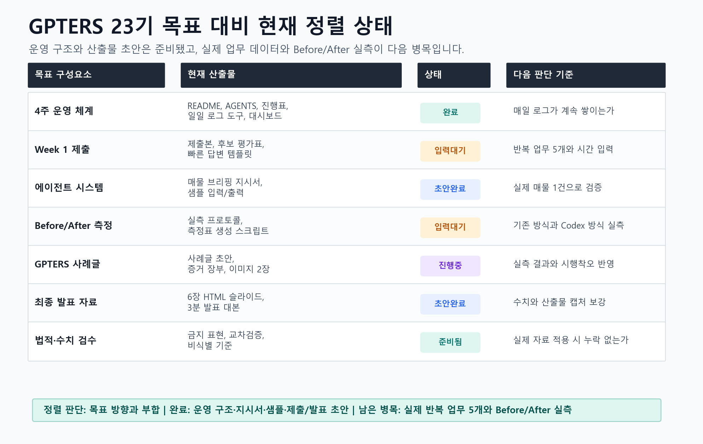

# 목표 대비 현재 정렬 리뷰

## 결론

현재 작업은 GPTERS 23기 목표에 부합합니다. 다만 지금까지의 성과는 `실행 구조 구축`과 `제출·발표 초안 준비`에 집중되어 있고, 아직 `신화님의 실제 반복 업무 데이터`와 `Before/After 실측 결과`는 들어오지 않았습니다.

따라서 현재 상태는 `방향은 맞고, 실전 데이터 투입 전 단계`입니다.

## 목표별 정렬 상태

| 목표 구성요소 | 현재 산출물 | 상태 | 다음 판단 기준 |
|---|---|---|---|
| 4주 운영 체계 | README, AGENTS, 진행표, 일일 로그 도구, 대시보드 | 완료 | 매일 로그가 계속 쌓이는가 |
| Week 1 제출 | 제출본, 후보 평가표, 빠른 답변 템플릿 | 입력대기 | 반복 업무 5개와 시간 입력 |
| 에이전트 시스템 | 매물 브리핑 지시서, 샘플 입력/출력 | 초안완료 | 실제 매물 1건으로 검증 |
| Before/After 측정 | 실측 프로토콜, 측정표 생성 스크립트 | 입력대기 | 기존 방식과 Codex 방식 실측 |
| GPTERS 사례글 | 사례글 초안, 증거 장부, 이미지 2장 | 진행중 | 실측 결과와 시행착오 반영 |
| 최종 발표 자료 | 6장 HTML 슬라이드, 3분 발표 대본 | 초안완료 | 수치와 산출물 캡처 보강 |
| 법적·수치 검수 | 금지 표현, 교차검증, 비식별 기준 | 준비됨 | 실제 자료 적용 시 누락 없는가 |

## 시각 자료

## 지금까지 잘 맞는 점

- 과정의 최종 산출물인 `업무 자동화 주제`, `작업지시서`, `개인용 에이전트 시스템`, `사례글`, `발표 자료`가 모두 파일 구조 안에 자리 잡았습니다.
- 공인중개사 업무 특성상 중요한 `수치 검수`, `법적 단정 금지`, `비식별 처리`, `고객 문구와 내부 메모 분리`가 별도 기준으로 정리되어 있습니다.
- 나중에 사례글을 쓸 때 기억에 의존하지 않도록 `증거 장부`, `일일 로그`, `실측표`, `이미지 생성 스크립트`가 준비되어 있습니다.

## 아직 부족한 점

- 실제 반복 업무 5개가 아직 입력되지 않았습니다.
- 기존 방식의 실제 소요 시간이 아직 측정되지 않았습니다.
- Codex 적용 후 처리 시간이 아직 측정되지 않았습니다.
- 실제 매물 자료로 에이전트 지시서를 검증하지 않았습니다.

## 다음 한 걸음

신화님이 최근 반복 업무 5개와 대략적인 소요 시간을 알려주면 됩니다. 그 다음에는 `data/repeated-work-items.csv`, `output/week1-submission/repeated-work-summary.md`, `output/week1-submission/week1-assignment.md`, `docs/automation-priority-matrix.md`를 실제 데이터 기준으로 갱신합니다.
