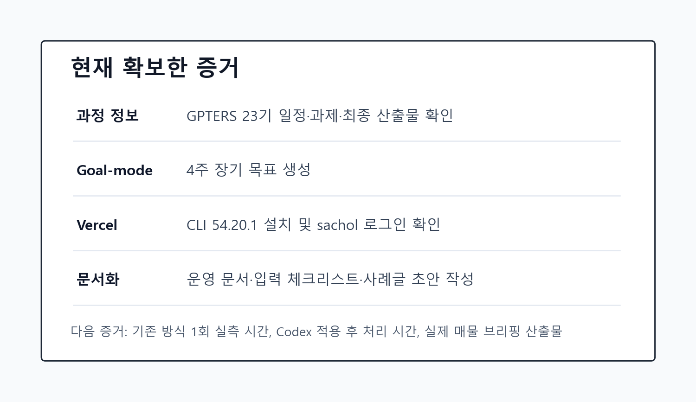
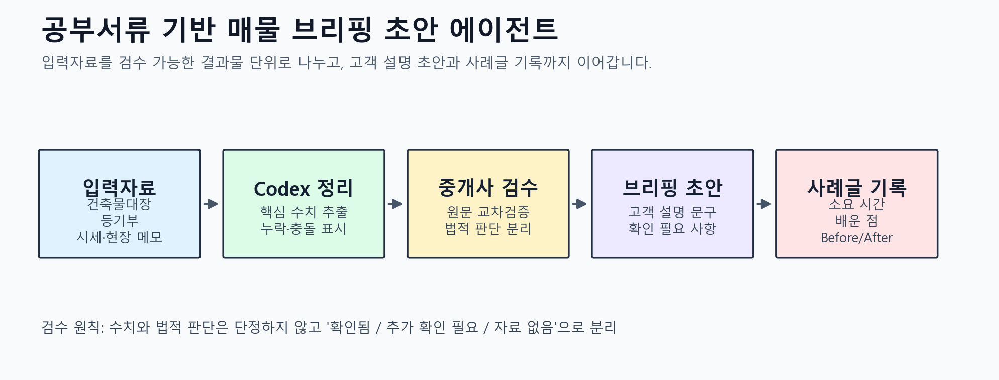

# 공부서류 기반 매물 브리핑 초안 에이전트 만들기 - GPTERS 23기 Codex 앱 실험

> 카테고리: Codex 앱 업무 자동화 / 공인중개사 실무 자동화  
> 작성: 신화  
> 일자: 작성 중  
> 태그: Codex 앱, 공인중개사, 매물 브리핑, Goal-mode, Vercel, 업무 자동화



## 소개 - 왜 이 실험을 시도했는가

저는 공인중개사로 일하면서 매물 브리핑, 공부서류 확인, 고객 상담 정리를 반복해 왔습니다. 또 공인중개사를 대상으로 AI 중개실무를 가르치는 강사이기도 해서, 제 업무를 자동화하는 과정 자체가 좋은 강의 사례가 될 수 있다고 생각했습니다.

GPTERS 23기 Codex 앱 스터디에서는 단순히 AI 답변을 받는 데서 멈추지 않고, 실제 업무 파일과 기록, 검수 기준, 최종 발표 자료까지 이어지는 시스템을 만들어보려 합니다.

> 이번 실험의 가설: Codex 앱을 단순 질의응답 도구가 아니라 업무 목표, 입력자료, 결과물, 검수 기준을 함께 관리하는 에이전트로 쓰면 반복되는 매물 브리핑 준비 시간을 줄일 수 있습니다.

## 진행 방법 - 4주 워크플로



### Step 1. Goal-mode로 4주 목표를 고정했습니다

2026-07-04에 Codex 앱의 Goal-mode를 사용해 다음 장기 목표를 만들었습니다.

```text
GPTERS 23기 Codex 앱 4주 스터디 동안 공인중개사 업무 자동화 에이전트 시스템을 기획, 실행, 기록하여 최종 사례글과 발표 자료까지 완성한다.
```

이 목표를 기준으로 작업 폴더를 만들고, 과정 요약, 4주 실행계획, 자동화 후보, 에이전트 설계 초안, 매일 기록 템플릿을 정리했습니다.

### Step 2. 자동화 주제를 좁혔습니다

처음 후보는 여러 가지였습니다.

| 후보 | 자동화 가능성 | 강의 사례 적합성 |
|---|---|---|
| 공부서류 기반 매물 브리핑 초안 | 높음 | 높음 |
| 고객 상담 요약 및 후속 문자 초안 | 높음 | 높음 |
| 투자 검토 리포트 초안 | 중간 | 높음 |
| 블로그/강의 콘텐츠 재가공 | 중간 | 중간 |
| 매물 홍보 문구 생성 | 중간 | 중간 |

1차 주제는 `공부서류 기반 매물 브리핑 초안 자동화 에이전트`로 정했습니다. 공인중개사 실무 전문성이 잘 드러나고, 건축물대장·등기부·토지이용계획·실거래가처럼 검수 기준을 분명히 세울 수 있기 때문입니다.

### Step 3. 매일 기록할 구조를 만들었습니다

사례글을 마지막에 몰아서 쓰지 않기 위해 매일 다음 항목을 남기기로 했습니다.

| 항목 | 기록 이유 |
|---|---|
| 오늘 사용한 Codex 기능 | 어떤 기능이 실제 업무에 도움이 됐는지 확인 |
| 입력자료 | 재현 가능한 업무 흐름으로 만들기 |
| 결과물 | 실제 업무 산출물과 연결 |
| 기존 방식 대비 차이 | Before/After 측정 |
| 소요 시간 | 정량 비교 근거 확보 |
| 배운 점 | 사례글의 핵심 메시지 누적 |

### Step 4. Vercel CLI를 준비했습니다

추후 HTML 대시보드나 매물 브리핑 페이지를 배포할 수 있도록 Vercel CLI 설치 상태를 확인했습니다.

```bash
vercel --version
vercel whoami
npm list -g vercel --depth=0
where.exe vercel
python output\gpters-case-study\scripts\gen_images.py
```

확인 결과 Vercel CLI `54.20.1`이 설치되어 있었고, `sachol` 계정으로 로그인되어 있었습니다.

## 결과와 배운 점

### 현재까지 만든 결과물

| 결과물 | 역할 |
|---|---|
| 4주 실행계획 | 스터디 일정에 맞춘 실행 로드맵 |
| 자동화 후보표 | 업무 후보를 비교하고 1차 주제를 선택 |
| 에이전트 시스템 설계 초안 | 입력자료, 처리 흐름, 출력자료 정의 |
| 매일 실행 루틴 | 매일 30분씩 실험하고 기록하는 운영 방식 |
| 매물 브리핑 입력 체크리스트 | 실제 매물 자료를 넣기 전 필수 정보 확인 |
| 사례글 증거 장부 | 실제 명령, 자료 출처, 시간 측정 기록 |
| Week 1 준비 완료 체크리스트 | 첫 수업 전까지 채워야 할 항목 확인 |
| 전체 진행 추적표 | 최종 산출물 기준으로 남은 일을 관리 |
| 매물 브리핑 에이전트 실행 지시서 | 반복 실행 가능한 입력·처리·출력 기준 |
| 비식별 샘플 브리핑 출력 예시 | 실제 매물 없이 검수 구조를 테스트한 결과물 |
| 스터디 운영 대시보드 | 일정, 산출물, 오늘 할 일, 검수 리스크를 한 화면에 정리 |
| 자동화 후보 우선순위 평가표 | 1차 주제 선택 이유를 점수표로 설명 |
| Before/After 실측 프로토콜 | 실제 시간 단축을 측정하기 위한 기준표 |
| 3분 발표용 HTML 슬라이드 | 최종 발표 자료 초안 |
| 3분 발표 대본 초안 | 발표 시간대별 설명 문장 |
| Week 1 제출 패킷 | 첫 주 과제에 바로 사용할 본문 |
| 준비 상태 점검 스크립트 | 핵심 파일 존재 여부와 남은 수동 입력 확인 |

### 배운 점

**1. 자동화 주제는 작아야 시작할 수 있습니다.**  
처음부터 중개업 전체를 자동화하려고 하면 막연합니다. 그래서 `공부서류 기반 매물 브리핑 초안`처럼 입력자료와 결과물이 분명한 단위로 좁혔습니다.

**2. 부동산 업무 자동화는 검수 기준이 핵심입니다.**  
주소, 면적, 가격, 용도지역, 사용승인일 같은 수치는 틀리면 안 됩니다. Codex가 초안을 만들더라도, 원문 공부서류와 교차검증해야 할 항목을 분리해야 합니다.

**3. 사례글은 마지막에 쓰는 것이 아니라 매일 쌓는 것입니다.**  
실제 명령, 소요 시간, 실패한 지점, 수정한 프롬프트를 매일 남기면 최종 사례글의 신뢰도가 높아집니다.

> 지금까지의 가장 큰 배움: Codex에게 일을 잘 맡기려면 업무를 맡기는 것보다, 검수 가능한 결과물 단위로 잘게 나누는 일이 먼저입니다.

## 도움 받은 글

- GPTERS 23기 Codex 앱 스터디 소개 페이지: https://www.gpters.org/ai-study-list/post/ceoeum-mannaneun-kodegseu-aebeuro-singineung-hanassig-nae-eobmue-butigi-J4whX5gz8PFnB3q

## 다음에 채울 내용

- 기존 방식으로 매물 브리핑 1건을 처리한 실측 시간
- Codex 적용 후 같은 유형 업무의 처리 시간
- Week 1~4 실습별 실제 화면 기반 실험 기록
- 최종 Before/After 비교표
- 발표용 이미지 또는 워크플로 다이어그램
